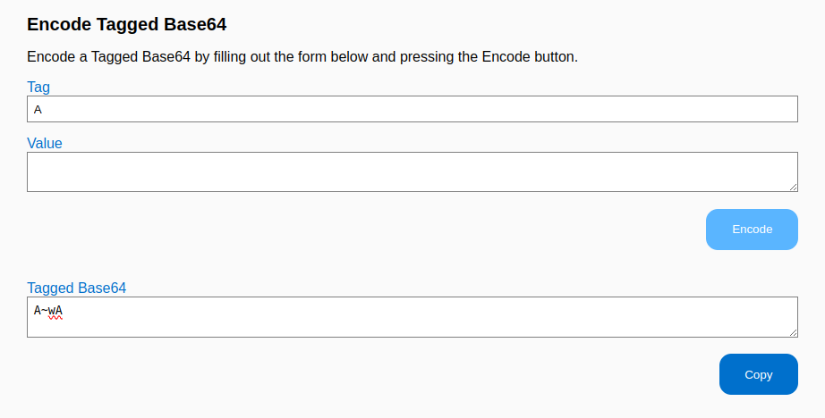
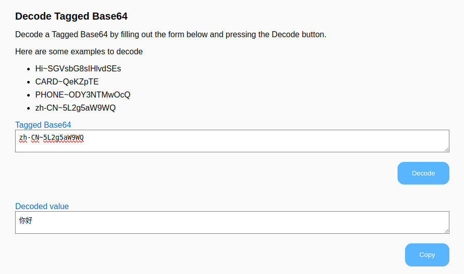

# Tagged Base64 Converter

Tagged Base64 Converter is a simple web app for encoding and decoding information in [Tagged Base64](https://github.com/EspressoSystems/tagged-base64) format. It is intended to be practical, but also to be a simple example of a web interface to a Rust library.

 

## Setup

For development, tools for building and packaging Rust, wasm, and JavaScript are needed. After the wasm assets are built, only a web server is needed.

- [Install or update Rust](https://www.rust-lang.org/tools/install)
- [Install Node.js](https://nodejs.org/en/download)
- [update npm](https://docs.npmjs.com/try-the-latest-stable-version-of-npm)
- [`cargo install wasm-pack`](https://rustwasm.github.io/wasm-pack/installer/)
- `wasm-pack build`
- `(cd www && npm install)`

## Development

- `wasm-pack build`
- `(cd www && [npm install](https://docs.npmjs.com/cli/v10/commands/npm-install))`
- `(cd www && NODE_OPTIONS=--openssl-legacy-provider [npm start](https://docs.npmjs.com/cli/v10/commands/npm-start))`

When you change the Rust code, you need to use `wasm-pack build` to recreate `tb64_wasm_shim_bg.wasm` and the wrappers in the `pkg` directory. Node finds these files via `www/package.json`.

:warning: _Both the pkg directory and the www directory contain a_ `package.json`_. The one in the pkg directory describes the wasm-related assets. The one in the www directory describes the web app._

```
wasm-pack build
```

Before you can run the web server, you need to install the required Node modules as described in `www/package.json`. Any time you update `www/package.json`, you'll need to run [`npm install`](https://docs.npmjs.com/cli/v10/commands/npm-install) again.
```
(cd www && npm install)
```

When you modify the JavaScript or HTML, assets usually reload automatically. Otherwise, kill and rerun `npm run start` and reload the browser window.
```
(cd www && NODE_OPTIONS=--openssl-legacy-provider npm run start)
```

NODE_OPTIONS must include --openssl-legacy-provider because wasm-pack inherits [and issue](https://github.com/webpack/webpack/issues/14532) from [webpack](https://webpack.js.org/). A change to OpenSSL left a hash function deprecated. Webpack is planning to migrate to a different hash function for webpack 6.

[`www/package.json`](https://docs.npmjs.com/cli/v10/configuring-npm/package-json) tells NPM where to find things including the Wasm bytecodes and the JavaScript wrappers.

### Directories

- pkg - WASM and associated JavaScript and TypeScript wrappers generated by `wasm-pack build` and referenced by `www/package.json`
- src - Rust sources
- tests - Rust tests
- www - Web app

### Starting a New Rust/Wasm Project

If you want to create your own project without copying this one, you can use [wasm-pack-template](https://github.com/rustwasm/wasm-pack-template). To use instantiate the template you'll need [cargo-generate](https://cargo-generate.github.io/cargo-generate/index.html). Cargo-generate instantiates the author and project name in a few places.

```
cargo install cargo-generate
cargo generate --git https://github.com/rustwasm/wasm-pack-template
```

Setup an NPM package directory in `www`
```
[npm init wasm-app www](https://github.com/rustwasm/create-wasm-app)
```
- This creates the following files
  - bootstrap.js
  - index.html
  - index.js
  - LICENSE-APACHE
  - LICENSE-MIT
  - package.json
  - package-lock.json
  - README.md
  - webpack.config.js

## License

Licensed under either of

- [Apache License, Version 2.0](http://www.apache.org/licenses/LICENSE-2.0)
- [MIT license](http://opensource.org/licenses/MIT)

at your option.

### Contribution

Unless you explicitly state otherwise, any contribution intentionally
submitted for inclusion in the work by you, as defined in the Apache-2.0
license, shall be dual licensed as above, without any additional terms or
conditions.