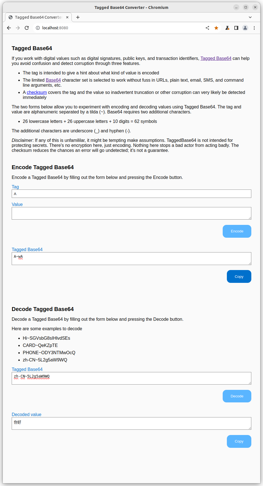

# Testing Tagged Base64 Converter

Tagged Base64 Converter is a simple web application with just two forms on a single page. There are some unit tests for the Rust shims. Manual user interface tests are described below. The Tagged Base64 library has its own unit tests.

The Tagged Base64 Converter web app is supposed to look something like this



## Versions

The project was built and tested on Linux, specifically Ubuntu 22.04.3 LTS.

### Rust

[Rust](https://www.rust-lang.org/)
- Target stable-x86_64-unknown-linux-gnu (default)
- Compiler rustc 1.74.1 (a28077b28 2023-12-04)

[TaggedBase64](https://github.com/EspressoSystems/tagged-base64) version 0.2.4

[wasm-pack](https://rustwasm.github.io/docs/wasm-pack/) version 0.12.1

[create-web-app]() A Node script in www/.bin used to clone a template project

### Node.js

[Node.js®](https://nodejs.org/en/about) version v20.5.1

### WebAssembly (Wasm)

[WebAssembly](https://webassembly.org/)

### Web Browsers

- [Chromium](https://www.chromium.org/Home/) 119.0.6045.159 (Official Build) snap (64-bit)
- [Firefox](https://www.mozilla.org/en-US/firefox/new/) 120.0

## Unit Tests

Automated testing of the Rust entry points is performed by running

```
wasm-pack test --node
```
The test output looks something like this
```
corbett@nao:~/git/wasm/wasm-game-of-life$ wasm-pack test --node
[INFO]: 🎯  Checking for the Wasm target...
   Compiling wasm-game-of-life v0.1.0 (/home/corbett/git/wasm/wasm-game-of-life)
    Finished dev [unoptimized + debuginfo] target(s) in 0.36s
[INFO]: ⬇️  Installing wasm-bindgen...
    Finished test [unoptimized + debuginfo] target(s) in 0.05s
     Running unittests src/lib.rs (target/wasm32-unknown-unknown/debug/deps/wasm_game_of_life-bf4ee8c890b2fe2e.wasm)
no tests to run!
     Running tests/web.rs (target/wasm32-unknown-unknown/debug/deps/web-cb883d2f91322c00.wasm)
Set timeout to 20 seconds...
running 4 tests                                   

test web::test_encode_tb64_sad ... ok
test web::test_encode_tb64_happy ... ok
test web::test_parse_sad ... ok
test web::test_parse_happy ... ok

test result: ok. 4 passed; 0 failed; 0 ignored
```

## Manual Tests

Here's are known answers for manual testing.

## Decoding Happy Path

1. Copy `Hi~SGVsbG8sIHlvdSEs` to the **Tagged Base64** text area
1. Click the **Decode** button
1. Observe the text in the **Decoded value** text area. It should be `Hello, you!`
1. Repeat for the following

| TaggedBase64        | Decoded Value |
| :----------:        | :-----------: |
| Hi~SGVsbG8sIHlvdSEs | Hello, you!   |
| CARD~QeKZpTE        | A♥            |
| PHONE~ODY3NTMwOcQ   | 8675309       |
| zh-CN~5L2g5aW9WQ    | 你好           |
| ~AA                 |               |
| A~wA                |               |

Note: The last two rows decode to the empty string.

## Encoding Happy Path

1. Copy `Hi` to the **Tag** input, and copy `Hello, you!` to the **Value** text area
1. Click the **Encode** button
1. Observe the text in the **Tagged Base64** text area. It should be, `SGVsbG8sIHlvdSEs`

| Tag   |  Value           | Encoded TaggedBase64  |
| :---: | :--------------: | :-------------------: |
| Hi    | Hello, you!      | Hi~SGVsbG8sIHlvdSEs   |
| CARD  | A♥               | CARD~QeKZpTE          |
| PHONE | 8675309          | PHONE~ODY3NTMwOcQ     |
| zh-CN | 你好              | zh-CN~5L2g5aW9WQ      |
|       |                  | ~AA                   |
| A     |                  | A~wA                  |

## Encode Tagged Base64 Error Messages

The Tag input is restricted to upper case letter, lower case letters, digits, underscore, and hyphens. Any other characters should be rejected with an alert,

    Error: An invalid character was found in the tag.

There are no restrictions on the Value field.

## Decode Tagged Base64 Error Messages

Valid Tagged Base64 encodings have three parts

1. An optional tag
2. A tilde (~) separating the tag and value
3. A Base64 value with at least two characters

Arbitrary choices for the Base64 value are unlikely to decode successfully due to the checksum. The error messages come straight from
the TaggedBase64 crate (library) and are intended to help software developers. You may see any of the following error alerts

- Error: Missing delimiter.

- Error: The length of the base64-encoded value is invalid.

- Error: The checksum was truncated or did not match.

- Error: The last non-padding input symbol's encoded 6 bits have nonzero bits that will be discarded. This is indicative of corrupted or truncated Base64. Unlike InvalidByte, which reports symbols that aren't in the alphabet, this error is for symbols that are in the alphabet but represent nonsensical encodings.

## Copy Buttons

Each form has a **Copy** button to write the output of the form to the clipboard to save the user from needing to select and copy it.

When either of the **Copy** buttons is pressed, a message

    Copied!

should appear for 3 seconds below the **Copy** button that was pressed and then disappear without disturbing the page layout.

The clipboard should then have the contents of the corresponding text area. The copy buttons are handy for roundtrip testing where
the output of encoding is then decoded yielding the value that was encoded.